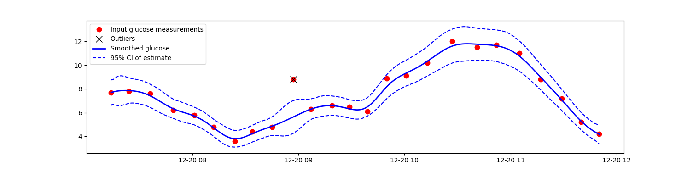

# PyKalmanSmoothingGlucose

[](https://github.com/omstaal/kalman-smoothing-glucose?tab=readme-ov-file)

This is a Python implementation of the Kalman smoothing described in [1]. Matlab implementation is available [here](https://github.com/omstaal/kalman-smoothing-glucose?tab=readme-ov-file).

The filter can apply offline Kalman smoothing, performs outlier detection and removal, and uncertainty estimation.



## Example Usage

Setup and activate virtual environment. 

Mac:
```
python -m venv kalman_venv
source kalman_venv/bin/activate
```
Windows:
```
python -m venv kalman_venv
.kalman_venv\Scripts\activate
```
Install requirements:
```
pip install -r requirements.txt
```
Run test example:
```
python example/test.py
```


TO DO: Describe how to use with your own files. How to resample etc...
TO DO: Describe the output dict when calling a function. Give a sample code here..! 

TO DO: EXPLAIN THE DIFFERENCE BETWEEN EACH INPUT CONFIGURATION POSSIBLE, and also which inputs are valid! What are different dynamic models? What are outlier removal == 2? 


## References
[1] [Staal, O. M., Sælid, S., Fougner, A., & Stavdahl, Ø. (Year). *Kalman Smoothing for Objective and Automatic Preprocessing of Glucose Data*. IEEE Journal of Biomedical and Health Informatics.](https://ieeexplore.ieee.org/document/8305603)


